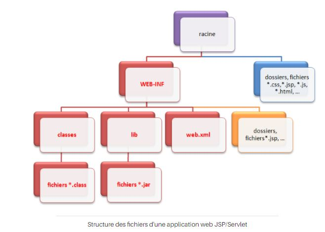
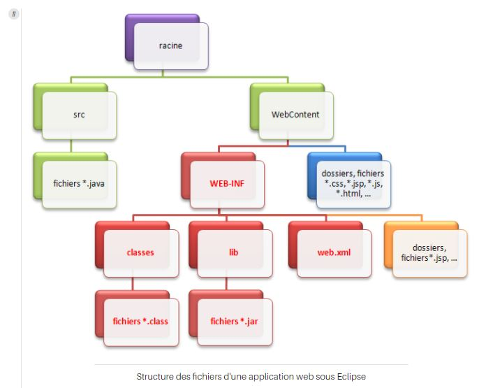

# Outils et environnement de développement

La création d’une application web avec Java EE s’effectue généralement à l’aide d’un environnement de développement intégré (raccourci en IDE en anglais), ce qui facilite grandement le développement dans son ensemble. Nous allons apprendre à en utiliser un et y intégrer notre serveur d’applications.

## L’IDE Eclipse
Massivement utilisé en entreprise, c’est un outil puissant, gratuit, libre et multiplateforme.
Les avantages d’un IDE dans le développement web Java EE sont :
- intégration des outils nécessaires au développement et au déploiement d’une application
- paramétrage aisé et centralisé des composants d’une application
- multiples moyens de visualisation de l’architecture d’une application
- génération automatique de portions de code
- assistance à la volée lors de l’écriture de code
- outils de débogage

## Le serveur Tomcat
Pour faire fonctionner une application web Java EE, nous avons besoin de mettre en place un **serveur d’applications**.
Nous utiliserons Tomcat. Tomcat tire sa légèreté du fait qu’il n’est en réalité que l’assemblage d’un **serveur web** (gestion des requêtes/réponses HTTP) et d’un **conteneur web** (nous parlerons en temps voulu de **conteneur de servlets**, et reviendrons sur ce que cela signifie concrètement). Ce n’est pas un serveur d’applications Java EE au sens complet du terme car il ne respecte pas entièrement ses spécifications et ne supporte pas toutes ses technologies.

Dans le répertoire d’installation de Tomcat (souvent appelé Tomcat Home), il y a un dossier nommé **webapps** : c’est ici que seront stockées par défaut les applications.  
Dans le dossier conf, il y a les fichiers suivants :
- serveur.xml : contient les éléments de configuration du serveur
- context.xml : contient les directives communes à toutes les applications web déployées sur le serveur
- tomcat-users.xml : contient entre autres l’identifiant et le mot de passe permettant d’accéder à l’interface d’administration du serveur Tomcat
- web.xml : contient les paramètres de configuration communs à toutes les applications web déployées sur le serveur

Il y a un fichier **context.xml** associé à toutes les applications. Pour permettre plus de souplesse, il est possible de spécifier un contexte propre à chaque webapp.
Ces applications web sont empiriquement contenues dans le dossier webapps du Tomcat home. C’est ici que par défaut, Tomcat ira chercher les applications qu’il doit gérer et déployer. Le souci est que notre projet créé depuis Eclipse se trouve dans un répertoire de notre workspace Eclipse et pas dans le répertoire webapps de Tomcat. Pour que notre serveur prenne en compte notre future application, il va falloir arranger le coup. Plusieurs solutions s’offrent à nous :
- créer un répertoire du même nom que notre projet Eclipse, directement dans le dossier webapps de Tomcat, et y copier-coller nos fichiers de notre workspace Eclipse, à chaque modification de code ou de configuration effectuée
- créer un nouveau projet depuis Eclipse en utilisant directement le répertoire webapps du Tomcat Home comme workspace Eclipse
- modifier le serveur.xml ou le context.xml de votre Tomcat, afin qu’il sache où chercher
- utiliser les propriétés d’un projet web dynamique sous Eclipse

Nous allons utiliser la quatrième et dernière solution, conserver le nom de notre projet sous Eclipse comme contexte de notre serveur. Cela permet alors de ne pas avoir à modifier nous-même le contexte de notre serveur, ou encore à ne pas avoir à utiliser le dossier webapps de notre serveur Tomcat en guise de workspace. Toute modification sur nos futures pages et classes sera ainsi automatiquement prise en compte par notre serveur Tomcat qui s’occupera de recharger le contexte à chaque modification sauvegardée, lorsque le serveur sera lancé.

## Structure d’une application Java EE

### Structure standard
Toute application web Java EE doit respecter une structure de dossiers standard, qui est définie dans les spécifications de la plate-forme.

- La racine de l’application, en violet sur le schéma, est le dossier qui porte le nom de notre projet et qui contient l’intégralité des dossiers et fichiers de l’application.
- Le dossier **WEB-INF** est un dossier spécial. Il doit obligatoirement exister et être placé sous la racine de l’application. Il doit à son tour obligatoirement contenir :
  - le fichier de configuration de l’application (web.xml)
  - un dossier nommé classes, qui contient les classes compilées
  - un dossier nommé lib, qui contient à son tour les bibliothèques nécessaires au projet (archives .jar)  
Tous les dossiers et fichiers marqués en rouge doivent obligatoirement être nommés et placés comme indiqué sur le schéma.
- les fichiers et dossiers persos placés directement sous la racine, en bleu sur le schéma, sont publics et donc accessibles directement par le client via leurs URL.
- les fichiers et dossiers persos placés sous le répertoire WEB-INF, en orange sur le schéma, sont privés et ne sont donc pas accessibles directement par le client.

Si notre application n’est pas organisée de cette manière, le serveur d’applications ne sera pas capable de la déployer ni de la faire fonctionner correctement.

### Notre première page web
Eclipse modifie la structure d’une application Java EE.

Eclipse déplace la structure standard de l’application vers un dossier nommé **WebContent** et ajoute sous la racine un dossier nommé **src** qui contiendra le code source de nos classes (fichiers .java). Eclipse ajoute également sous la racine quelques fichiers de configuration qui lui permettront de gérer correctement l’application.
Eclipse se débrouille via une tambouille interne pour que la structure qu’il a modifié soit malgré tout utilisable sur le serveur d’applications que nous lui avons intégré.
Ceci implique deux choses très importantes :
- le dossier WebContent n’existe légitimement qu’au sein d’Eclipse. En développant sans IDE, ce répertoire ne doit pas exister et l’application doit suivre impérativement la structure standard
- pour cette même raison, si on souhaite utiliser l’application en dehors de l’IDE, il faut obligatoirement utiliser l’outil d’export proposé par Eclipse. Réaliser un simple copier-coller des dossiers ne fonctionnera pas en dehors d’Eclipse.

**Création d’une page web**  
Nous allons créer une page HTML "test.html" dans le dossier public, c’est-à-dire dans le dossier WebContent. En lançant le serveur Tomcat, on peut accéder à la page via un navigateur en écrivant l’URL http://localhost:8080/nomProjet/test.html
